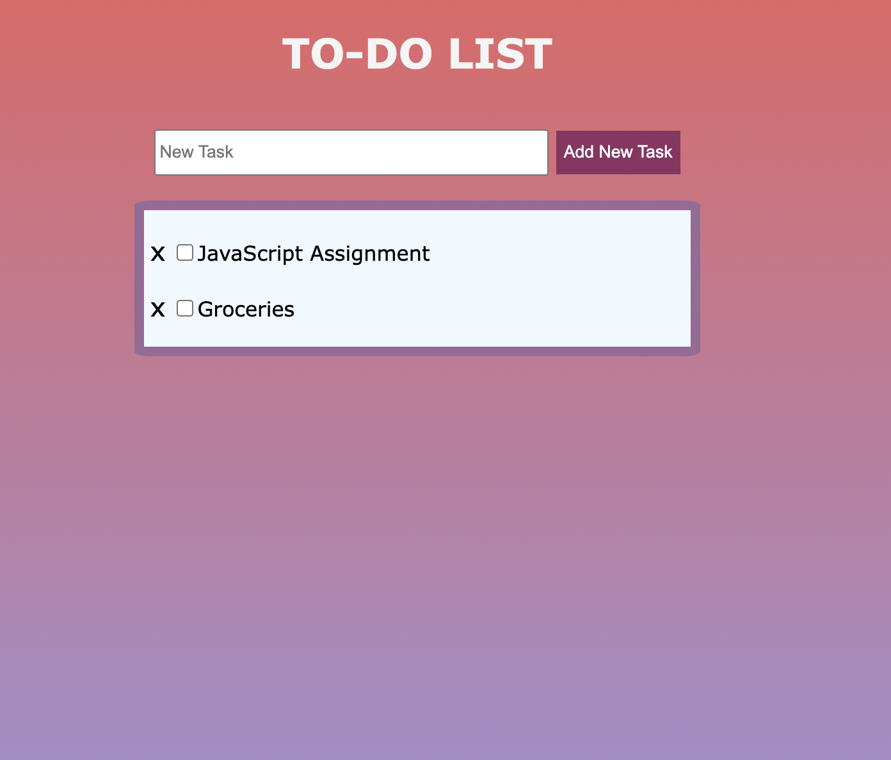

#Basic To-do List application 

It was one of my milestone assignments within the JS Course. The following features are enabled: 
- adding new tasks 
- deleting existing tasks
- checking the box for completed tasks 

No external libraries are used. It was created using Vanilla JavaScript, HTML, and CSS